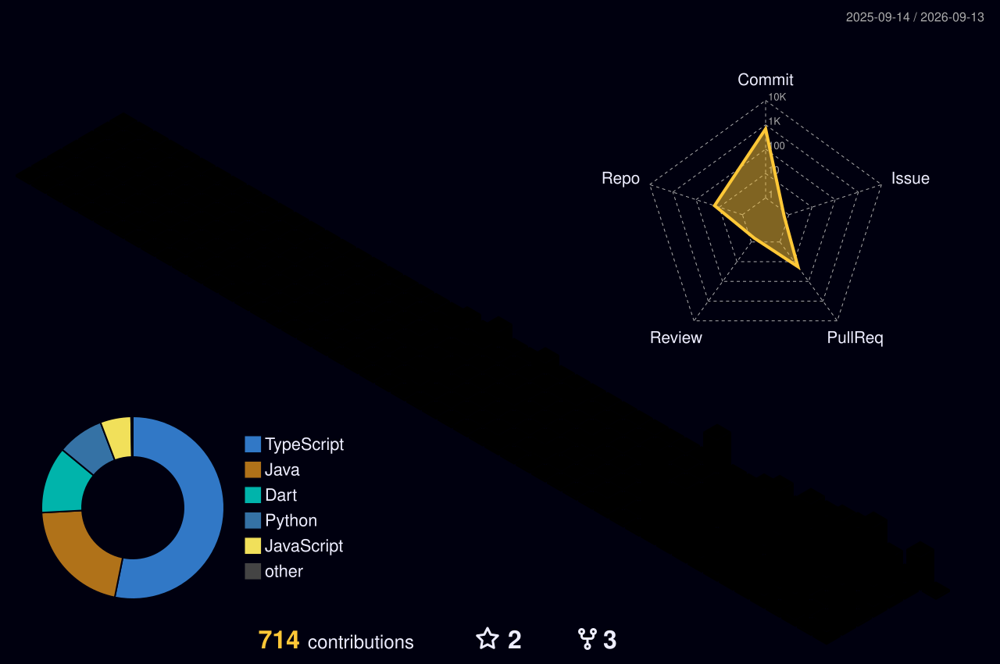
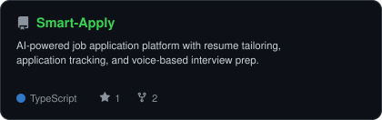
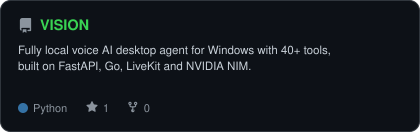

<!-- NAME / TAGLINE - animated typing -->

 

<!-- SOCIALS (Sleek Dark Theme) -->

  

 

## ⚡ Executive Summary

I am a software engineer focused on building robust backends, intelligent AI pipelines, and high-performance cross-platform applications. I prioritize architectural elegance and shipping production-ready systems.

- 🚀 **Current Mission:** Building **HARMONIX** (Music App).
- 🧠 **Core Expertise:** Python · React · TypeScript · MongoDB · Redis
- 🎓 **Background:** B.Tech CSE (Information Technology) at Aditya College of Engineering and Technology
- 🏆 **Milestones:** Ranked 14th of 1,517 in an Oracle-partnered SQL competition, and 2nd in the Project Space Hackathon.

 

## 🧠 Tech Arsenal

| Focus Area | Technologies |
| :--- | :--- |
| **Frontend** |  |
| **Backend & Databases** |  |
| **Tools & IDEs** |  |

 

## 📊 Analytics & Activity

<!-- 3D Lego calendar, regenerated by .github/workflows/lego-3d.yml -->
<picture>
  <source media="(prefers-color-scheme: dark)"  srcset="profile-3d-contrib/profile-night-rainbow.svg">
  <source media="(prefers-color-scheme: light)" srcset="profile-3d-contrib/profile-gitblock.svg">
  
</picture>

  

<table>
<tr>
<td width="50%" align="center" valign="top">
  
</td>
<td width="50%" align="center" valign="top">
  
</td>
</tr>
</table>

 

## 🌌 Featured AI & Full-Stack Projects

Building highly scalable architectures powered by state-of-the-art AI.

<!-- Cards generated by scripts/cards.py from assets/projects.json.
     Stars, forks and language are pulled live from the API on every run. -->
<table>
<tr>
<td width="50%">
  <a href="https://github.com/NandiVardhan2007/Smart-Apply">
    <picture>
      <source media="(prefers-color-scheme: dark)"  srcset="assets/card-Smart-Apply-dark.svg">
      <source media="(prefers-color-scheme: light)" srcset="assets/card-Smart-Apply-light.svg">
      
    </picture>
  </a>
</td>
<td width="50%">
  <a href="https://github.com/NandiVardhan2007/VISION">
    <picture>
      <source media="(prefers-color-scheme: dark)"  srcset="assets/card-VISION-dark.svg">
      <source media="(prefers-color-scheme: light)" srcset="assets/card-VISION-light.svg">
      
    </picture>
  </a>
</td>
</tr>
</table>

| Project | Live Demo | Tech Stack |
|:---|:---|:---|
| **[Smart-Apply](https://github.com/NandiVardhan2007/Smart-Apply)** | [Live](https://smartapplies.app) | `FastAPI` `MongoDB` `AI` |
| **[VISION](https://github.com/NandiVardhan2007/VISION)** | - | `Python` `Go` `AI` |
| **[Personal-Portfolio](https://github.com/NandiVardhan2007/Personal-Portfolio)** | [Live](https://nandu-portfolio.onrender.com) | `Next.js` `TypeScript` |

 
